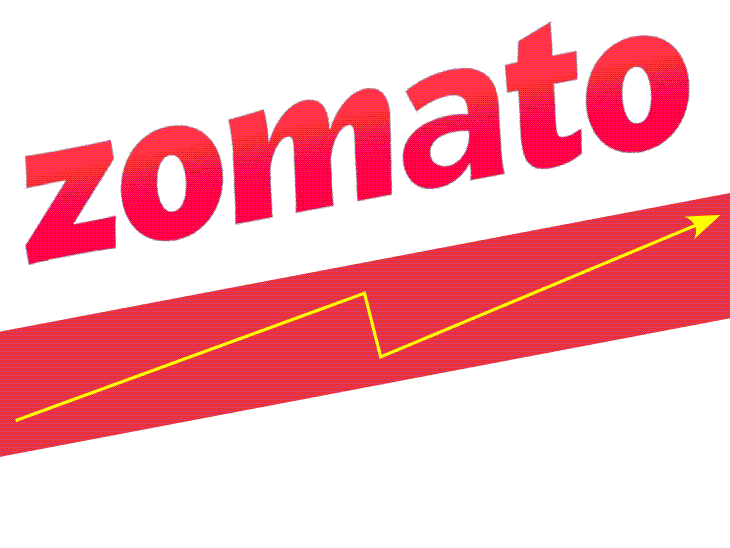
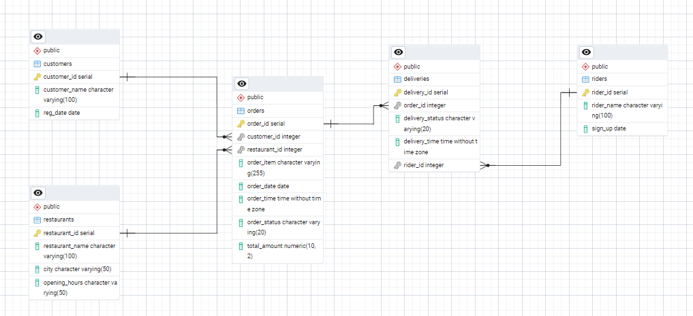

# 🍽️ Zomato Food Delivery Data Analysis Using SQL

## 📌 Introduction
The **food delivery industry**  is rapidly growing, with companies like **Zomato** leading the market. This project leverages SQL-based data analysis to extract insights on customer behavior, restaurant performance, delivery trends, and revenue patterns.

- 📊 **Customer behavior**
- 🍔 **Restaurant performance**
- 🚴 **Delivery trends**
- 💰 **Revenue patterns**

By analyzing structured datasets—including **orders, customers, restaurants, deliveries, and riders**—this project uncovers key business insights. Advanced **SQL techniques** such as **joins, aggregations, ranking functions, and window functions** help in optimizing operations, marketing strategies, and customer experience.

## 🎯 Objective
The primary goal of this project is to **analyze Zomato's operational and customer data** using **SQL** to extract actionable insights and enhance efficiency & profitability.

### 🔍 **Key Goals:**
✅ **Understanding customer behavior** – Identifying repeat customers, high-value customers, and spending patterns.  
✅ **Evaluating restaurant performance** – Ranking restaurants based on **revenue, order volume, and demand**.  
✅ **Analyzing delivery efficiency** – Measuring rider performance through **delivery times, delays, and efficiency comparisons**.  
✅ **Tracking seasonal demand** – Identifying trends based on **seasons, weekdays vs. weekends, and special events**.  
✅ **Optimizing marketing and promotions** – Determining the best time for **discounts & promotions** to maximize revenue.  

This **SQL-driven analysis** empowers **Zomato** to **optimize customer engagement, streamline logistics, and boost revenue generation** by improving **order fulfillment, delivery management, and targeted marketing strategies**.  

## 📂 Dataset Description
The project is based on multiple datasets:
- **📦 Orders:** Order details, customer ID, total amount, order date.
- **👤 Customers:** Customer demographics, customer ID, location.
- **🏬 Restaurants:** Restaurant details, revenue, and locations.
- **🚴 Deliveries:** Delivery time, delivery status, assigned rider.
- **🛵 Riders:** Rider details, delivery efficiency, performance.

## Entity-Relationship (ER) Diagram 🏗️

Below is the ER Diagram representing the database schema for this project:

## 🛠️ Methodologies Used

1. **Joins**  
   🔗 Combine multiple tables (e.g., INNER, LEFT JOIN) to integrate data across orders, customers, restaurants, deliveries, and riders.

2. **Aggregations**  
   🔢 Use functions like SUM, COUNT, and AVG to compute metrics such as revenue and order volumes.

3. **Ranking Functions**  
   📊 Employ RANK, DENSE_RANK, and ROW_NUMBER to order restaurants, riders, and other entities based on performance.

4. **Window Functions**  
   🔄 Utilize LAG and LEAD to compare current rows with previous or subsequent rows for trend analysis.

5. **Date Functions**  
   📅 Extract and manipulate date information using MONTH, YEAR, DATEADD, and DATEDIFF to analyze seasonal trends.

6. **Common Table Expressions (CTEs)**  
   📋 Break complex queries into manageable, reusable parts for clarity and maintenance.

7. **Filtering & Conditional Logic**  
   🔍 Apply WHERE, HAVING, and CASE statements to segment data and implement conditional analysis.

8. **Set Operations**  
   🔀 Merge or compare datasets using UNION, INTERSECT, and EXCEPT for comprehensive result sets.

9. **Data Type Conversion**  
   🔄 Use CAST and CONVERT to ensure data is in the correct format for analysis.

10. **Query Optimization**  
    ⚡ Enhance performance through indexing and efficient query design.

## 📌 Project Breakdown (Questions & Categories)

### 🟢 Basic Level:
1️⃣ Total orders per customer.  
2️⃣ Total revenue generated by each customer (CLV).  
3️⃣ Number of orders per restaurant.  
4️⃣ Revenue generated by each restaurant.  
5️⃣ Average order value.  

### 🔵 Intermediate Level:
6️⃣ Monthly sales trends analysis.  
7️⃣ Identifying high-value customers.  
8️⃣ Rider efficiency based on delivery times.  
9️⃣ Seasonal demand analysis.  
🔟 City-wise revenue ranking.  

### 🔴 Advanced Level:
🔢 Year-over-year revenue trends.  
🔢 Identifying peak ordering hours.  
🔢 Evaluating discount impact on sales.  
🔢 Identifying top-performing restaurants.  
🔢 Customer segmentation based on order behavior.  

## 📊 Key Findings
🔹 **High-Value Customers:** A small percentage of customers contribute to a large portion of total revenue.  
🔹 **Peak Order Times:** Most orders occur during lunch (12 PM - 2 PM) and dinner (7 PM - 9 PM).  
🔹 **Delivery Efficiency:** Some riders consistently deliver faster than others, impacting overall service ratings.  
🔹 **Seasonal Demand:** Orders increase during festival seasons and weekends.  
🔹 **Marketing Optimization:** Discounts during off-peak hours lead to increased orders without hurting profit margins.  

## 💡 Recommendations
🚀 **Improve delivery efficiency** – Optimize rider allocation and reduce delays.  
🎯 **Target high-value customers** – Personalized promotions for repeat customers.  
📢 **Enhance restaurant partnerships** – Identify and promote high-performing restaurants.  
📈 **Seasonal strategies** – Offer seasonal discounts to capitalize on peak demand.  
💰 **Dynamic pricing models** – Adjust pricing based on demand trends.

## 🔚 Conclusion
This **SQL-driven data analysis** provides actionable insights to help **Zomato optimize operations, improve customer satisfaction, and boost revenue**. With data-driven strategies, Zomato can enhance its food delivery services and strengthen its market position. 🚀
